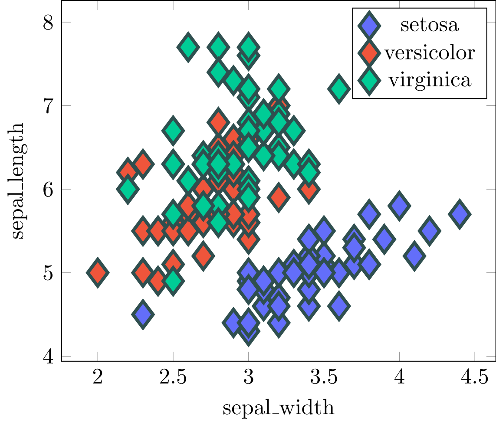

# Other features supported


## Marker style

From [Styling Markers in Python](https://plotly.com/python/marker-style/).

??? example "Marker Style Example"
    ```python
    import plotly.express as px
    import tikzplotly

    df = px.data.iris()
    fig = px.scatter(df, x="sepal_width", y="sepal_length", color="species")

    fig.update_traces(
        marker=dict(size=8, symbol="diamond", line=dict(width=2, color="DarkSlateGrey")),
        selector=dict(mode="markers"),
    )

    tikzplotly.save("marker_style.tex", fig)
    ```

    


!!! Note
    - There are somes markers implemented in plotly that are not available in pgfplots (or at least not referenced in the [documentation](https://tikz.dev/pgfplots/reference-markers)). For more details, refer to the example [test_markers](https://github.com/thomas-saigre/tikzplotly/blob/main/tests/test_markers.py). By defualt, the marker style `*` will be used.
    - By default, the colors or the markers are not the same in plotly and pgfplots. For instance, if nothing is specified, plotly will always use a dot marker, while pgfplot will change for each trace.